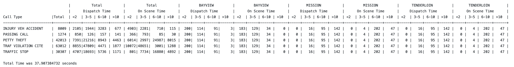

[](https://classroom.github.com/a/uyt8eNCr)
# Assignment 4 – Processing CSV Data with Threads

Welcome to your forth homework assignment.  

**NOTE:** The GitHub due date is the CUTOFF time and **not** the actual due date. See Canvas for the actual due date.

**Assignment Purpose and Learning Outcomes:**
- Understanding CSV files and how to parse them
- Understanding error handling
- Processing large quantities of data
- Summarizing data based on specific fields and criteria
- Understanding and using Vectors (arrays of pointers)
- Comprehensive use of threads and understanding the timings
- Understanding of Race Conditions and preventing data corruption 

**Let me remind you of the general expectations for all projects:** 
- All projects are done in C in the Ubuntu Linux Virtual Machine.
- Code must be neat, with proper and consistent indentation and well documented. 
- Keep line to around 80 characters per line, and not line greater than 100 characters.
- Comments must describe the logic and reason for the code and not repeat the code.  
- Variables must have meaningful names and be in a consistent format (I do not care if you use camelCase or under_scores in variables but be consistent.
- You must use `make` to compile the program.
- You must use `make run` (sometimes with RUNOPTIONS) to execute the program.
- In addition, each file must have the standard header as defined below.
- All source files and writeup must be in the main branch of the github.
  
All primary filenames should be `<lastname>_<firstname>_HW<#>_<component>.<proper extension>`, except Makefile.

Each .c and .h file must have a standard header as defined below.  Make sure to put in your section number (replace the #), your name, your student ID, a proper project name, GitHub name, filename, and description of the project.  Do not alter the number of asterisks and ensure that the header starts on line 1 of the file.

```
/**************************************************************
* Class::  CSC-415-0# Spring 2024
* Name::
* Student ID::
* GitHub-Name::
* Project:: Assignment 4 – Processing CSV Data with Threads
*
* File:: <name of this file>
*
* Description::
*
**************************************************************/
```
This is an INDIVIDUAL assignment.  You can (and should) work in groups to research how to do the assignment, but each person should code their own version and make their own submission.

This assignment is in three specific parts:

1) Being able to open and correctly parse a CSV file
2) Being able to process data in order to summarize and visualize data
3) Being able to do these tasks in multiple threads


**For part 1 - CSV Processing**

A CSV (or Comma Separated Values) file is a text file where columnar (field) data is separated by commas.  But to handle columns that have commas within them we have to enclose that field within quotation marks ("), if the field has quotation marks in it then the entire field should be enclosed in quotation marks and the embedded quotation mark has to be doubled ("").
All records within a CSV file are separated by a newline.  In simple terms, each line of the CSV file represents one record.  But, a field may contain a newline.  If a field does require a newline the entire field has to be enclosed in quotation marks.  So more accurately each record of a CSV file is separated by a non-quoted newline.

For this part you will create a file using our naming conventions with csv as the option - so `<lastname>_<firstname>_HW4_csv.c`.  You will also need a header file with the 4 function prototypes.

You will need to implement 4 functions:
1.	csvopen: Opens a CSV file, reads the first line (header), and returns a null-terminated array of C string pointers (a vector), each representing a column name. This function should also prepare the file for reading subsequent lines.  Return NULL on failure.  The caller should NOT free the memory associated with the header.

`char ** csvopen (char * filename);`

2.	csvnext: Reads the next line from the CSV file opened by csvopen, parses it according to CSV formatting rules (including handling quoted fields, escaped quotes, and embedded newlines), and returns a null-terminated array of strings (vector), each representing a cell value in the row.

`char ** csvnext (void);`

3.	csvheader: Returns the header read by csvopen as a null-terminated array of strings. This can be called at any time after csvopen to retrieve the header.  The caller should NOT free the memory associated with the header.

`char ** csvheader (void);`

4.	csvclose: Closes the CSV file and frees any memory still associated with managing the file (including the header.  Return -1 if an error otherwise return how many data lines had been read

`int csvclose (void);` 

To test your code run `make test` this will exercise the 4 functions with the test program.  Note that this is not 100% comprehensive but does cover most cases.

This is what your output should look like when you run `make test`:

```
student@student:~/CSC415/AssignmentCreation/CSVThreads$ make test
./Bierman_Robert_HW4_csv 
Header Column 00: Name - Last, First
Header Column 01: Age
Header Column 02: Favorite Color
Header Column 03: Comments


Data for line 1
Field 00: Bierman, Robert
Field 01: 943
Field 02: Blue
Field 03: What can I say, this is a large comment

Data for line 2
Field 00: Smith, John
Field 01: 28
Field 02: Green
Field 03: I want to have a multiple
line comment

Data for line 3
Field 00: Clark, Dwight "The Catch"
Field 01: 61
Field 02: Red & Gold
Field 03: 1981 NFC Championship


CSV Tests Passed
student@student:~/CSC415/AssignmentCreation/CSVThreads$
```

**For part 2 - Data Processing**

For this part you will build a data structure that keeps tract of every event type (specifically the field `call_type_final_desc`, unless that field is blank then use the `call_type_original_desc` field).  You will keep with each event type the total number of calls, the number of calls where the dispatch time is 2 minutes or less, from 3 to 5 minutes, 6 to 10 minute, and over 10 minutes, and the on scene times are 2 minutes or less, from 3 to 5 minutes, 6 to 10 minute, and over 10 minutes.  You will also selectively keep track of those times for either 3 neighborhoods or police districts.  Specifically 3 values from the `analysis_neighborhood` field or the `police_district` field depending on the command line parameters.  To calculate dispatch time parse and subtract the `received_datetime` from the `dispatch_datetime`.   To calculate the on scene time parse and subtract the `enroute_datetime` from the `onscene_datetime`.

The output should be well formatted and columnar with clear headings.  The event type should print our in alphabetical order.  This is a short example of what the output can look like:



You my use any data structure you like to hold the data as it is being processed, but it must be global (i.e. each thread will be adding directly to it and mot merging at the end) and you have to write the data structure code yourself, not using libraries. (Note: using string libraries for copying and comparing are okay). 

**For part 3 - Threading**
The catch, it is to do all this using threads. Each thread will request the next record of the file and process it, returning it’s results tallied to shared memory and then the main will print the results as specified above. Remember that this assignment will be using the pthread functions.  But we want to determine how long the program takes using different number of threads (separate runs).  To do so 

#include <time.h> in your code and in main, include the code below in your main.  This will display how much time your program takes.  Your submission should include a run with 1 thread, 2 threads, 4 threads, and 8 threads.  How do the times compare?

```
    //**************************************************************
    // DO NOT CHANGE THIS BLOCK
    //Time stamp start
    struct timespec startTime;
    struct timespec endTime;

    clock_gettime(CLOCK_REALTIME, &startTime);
    //**************************************************************

    // *** TO DO ***  start your thread processing
    //                wait for the threads to finish


    // ***TO DO *** Display Data

    //**************************************************************
    // DO NOT CHANGE THIS BLOCK
    //Clock output
    clock_gettime(CLOCK_REALTIME, &endTime);
    time_t sec = endTime.tv_sec - startTime.tv_sec;
    long n_sec = endTime.tv_nsec - startTime.tv_nsec;
    if (endTime.tv_nsec < startTime.tv_nsec)
        {
        --sec;
        n_sec = n_sec + 1000000000L;
        }

    printf("Total Time was %ld.%09ld seconds\n", sec, n_sec);
    //**************************************************************

```
There is a template main with this code provided. (Don't forget to rename it to the naming conventions).  Do not modify in any way the blocks that start and end the timers (including the asterisks).  Make sure that other than initialization code and cleanup code that your code is between these blocks where the `TO DO`'s are.


**Command Line Parameters**
```
<program> <csv filename> <threads> <subfield> <subfield value 1> <subfield value 2> <subfield value 3>
Ex: ./Bierman_Robert_HW4_main Law100K.csv 4 police_district BAYVIEW MISSION TENDERLOIN
Ex: ./Bierman_Robert_HW4_main Law100K.csv 2 analysis_neighborhood "Outer Richmond" "Glen Park" Mission
```

csv filename:  is the name of the CSV data set. One of the following (each of these are links to the file):
- [Law5K.csv](https://sfsu.box.com/s/ylali6ko46pi3ro8otyeeb90izk6zwo6)
- [Law50K.csv](https://sfsu.box.com/s/0lgwj7yqztx0958zjc8hu6gh4pynj4mz)
- [Law100K.csv](https://sfsu.box.com/s/allg12lehx0dnfxm0uwsq2041po7thch)
- [Law250K.csv](https://sfsu.box.com/s/6u1xq74ekchy3hbkka1xz2f1mzgkh6na)
- [Law500K.csv](https://sfsu.box.com/s/6biiv3l3rofb37zsbu913yza9sdiir0u)
- [Law1M.csv](https://sfsu.box.com/s/kkflha2s5sb8ryxa2w37i94188o2jtjy)
- [Law_Full.csv](https://sfsu.box.com/s/q1tll6i7z5195fd573aij7qkrvpcgzz3)

threads:  is how many threads you will dispatch to process the data.  Remember that you have to submit common runs with 1, 2, 4, and 8 threads using the Law100K.csv file.

subfield: is either `analysis_neighborhood`  or  `police_district`

The subfield value's (1, 2, and 3) is one of the field values from `analysis_neighborhood`  or  `police_district`

|                             |       Police Districts        |                        |
| --------------------------- | ----------------------------- | ---------------------- |
| BAYVIEW                     | NORTHERN                      | SOUTHERN               |
| CENTRAL                     | PARK                          | TARAVAL                |
| INGLESIDE                   | RICHMOND                      | TENDERLOIN             |
| MISSION                     |                               |                        |


|                             |     Neighborhoods             |                        |
| --------------------------- | ----------------------------- | ---------------------- |
| Bayview Hunters Point       | Lincoln Park                  | Potrero Hill           |
| Bernal Heights              | Lone Mountain/USF             | Presidio               |
| Castro/Upper Market         | Marina                        | Presidio Heights       |
| Chinatown                   | McLaren Park                  | Russian Hill           |
| Excelsior                   | Mission                       | Seacliff               |
| Financial District/South Beach | Mission Bay                 | South of Market        |
| Glen Park                   | Nob Hill                      | Sunset/Parkside        |
| Golden Gate Park            | Noe Valley                    | Tenderloin             |
| Haight Ashbury              | North Beach                   | Treasure Island        |
| Hayes Valley                | Oceanview/Merced/Ingleside    | Twin Peaks             |
| Inner Richmond              | Outer Mission                 | Visitacion Valley      |
| Inner Sunset                | Outer Richmond                | West of Twin Peaks     |
| Japantown                   | Pacific Heights               | Western Addition       |
| Lakeshore                   | Portola                       |                        |


**Hints** Do not forget to protect critical sections. Make sure you use thread safe library calls. Do not use pipes. You must use mutex locks.

Do a writeup using the template in PDF format that includes your approach in detail, issues, resolutions and an **analysis** of the results. Explain and reflect on why the times for the different runs are what they are, how does each run compare with the others. Also include the compilation and execution output from your program in the writeup. Your execution output should include at least 4 runs, 1 thread, 2 threads, 4 threads, and 8 threads. Submit all your source code file(s), Makefile and PDF writeup into GitHub. The writeup (PDF) should also be submitted to Canvas.

**Note** Do not change any of the settings of the virtual machine.


**Grading Rubric**
| Grade Item                     | Grade Points |
|--------------------------------|--------------|
| Header                         |            2 |
| Documented Code                |            8 |
| Command Line Arg.              |            5 |
| Passes CSVTest                 |            5 |
| Used Threads                   |           15 |
| Used and Displayed Timer Code  |            5 |
| Runs to Completion             |           10 |
| Correct Output                 |           10 |
| Double Thread 1/2 time         |           15 |
| Proper Use of Critical Section |           10 |
| Writeup                        |           15 |

